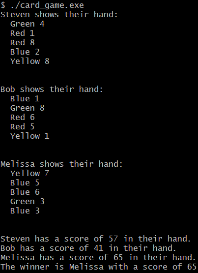
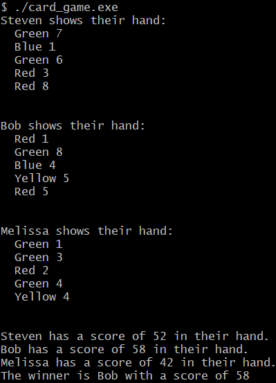

## Output

 
Every execution generates a different outcome with different results because of the random ordering.

## Compilation
`compile.sh` can be executed in terminal with g++ to compile source files and linking object files to executable.