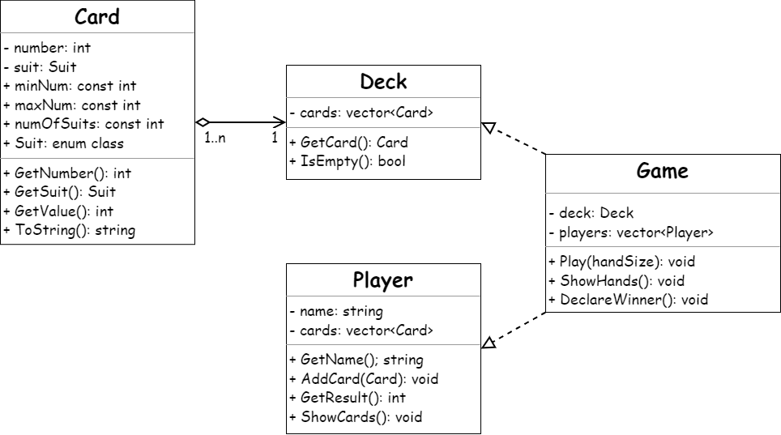

## Design

Game implements Deck and Player. Game acts as the running environment. Game runs three methods sequentially:
1. Play() - plays the Game, *handSize* determine amount of cards dealt to players.
2. ShowHands() - after cards have been dealt, every player show their hands and Game announces their results.
3. Declare() - Game compares and announces player results and then finally declares the winner.

Game is initialized with vector\<string> playerNames and Game creates Player objects from these playerNames. Deck is initialized with Card objects in a completely random order. This is why Deck needs a maxNum, minNum and numOfSuits to determine how many cards it can be initialized with and the random ordering.

I decided to put the information within the class itself incase it's desired to create an entirely new type of Card with different number range and suits. It also makes the current Game easily scaleable by just adding more suits to Suit enum or raising maxNum.

