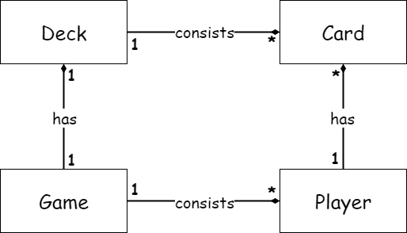
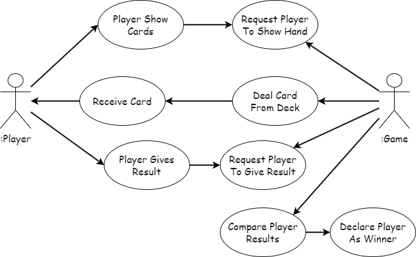

## Domain Modelling

#### Relationship between classes
* Every `Game` has <u>one</u> `Deck` (*One-To-One Relation*)
* Every `Game` consists of <u>many</u> `Player` (*One-To-Many Relation*)
* Every `Deck` consists of <u>many</u> `Card` (*One-To-Many Relation*)
* Every `Player` has <u>many</u> `Card` (*One-To-Many Relation*)

#### Behavior of each class
Use Case diagram for different use case interactions between `Game` and `Player`. These use cases should apply to every `Player`in a `Game` of *N* `Player` objects.

**Game**
* A `Game` class is the environment where `Player` objects exists.
* A `Game` class uses a `Deck` object to interact with the `Player` objects.
* A `Game` class can take `Card` objects from the `Deck` object and give to `Player` objects.
* A `Game` class should have a *DeclareWinner* method to compare `Player` results and declare `Player` object with biggest result as winner.

**Player**
* A `Player` class should have a *Name* attribute for identification.
* A `Player` class should have a *Cards* attribute to hold it's current cards.
* A `Player` class should have a *ShowCards* method to show it's current cards to `Game`.
* A `Player` class should have a *AddCard* method to receive a card from `Game`.
* A `Player` class should have a *GetResult* method to give total value of it's cards to `Game`. 

**Deck**
* A `Deck` class should have a *Cards* attribute to hold it's current cards.
* A `Deck` class should have a *GetCard* method to take cards from it's *Cards* attribute.

**Card**
* A `Card` class should have a *Suit* attribute to represent the suit multiplier.
* A `Card` class should have a *Number* attribute to represent the number.
* A `Card` class should have a *GetSuit* method to get the suit.
* A `Card` class should have a *GetNumber* method to get the number.
* A `Card` class should have a *GetValue* method to get the multiplication of *Suit* and *Number*.

#### Note
The issue with `Deck` class is that it's size depends on the type of `Card` class that it holds. In this exercise, it's maxSuitValue(4) * maxNumberValue(8) = 32. Ideally, you would make an `AbstractCard` class from which you could create unique kinds of `Card` classes. Every unique `Card` class should thus inherit common attributes by which the size of `Deck` can be determined from. This way the `Deck` class should be entirely independent of the type of `Card` being used.

